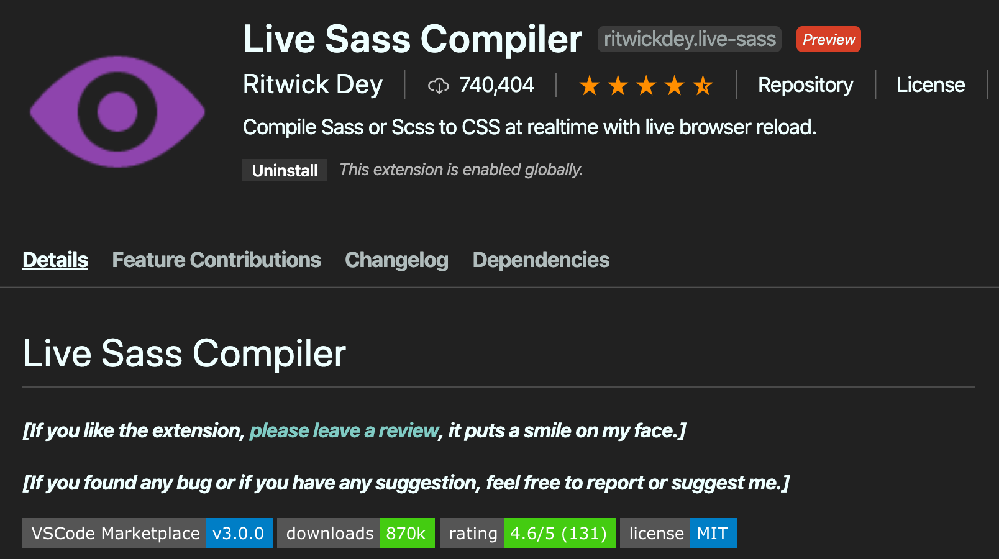
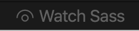

# Introducing SASS
`Sass` is a stylesheet language that’s compiled to `CSS`.<br>
> Sass helps keep large stylesheets well-organized and makes it easy to share design within and across projects.


## Use SASS in VSCode
Install `Live Sass Compiler` <br>

<br>
Create `style.scss` and then press the icon  over the bottom of **VSCode**

## Try Sass 
- [x] `Sass` converts `.scss` to `.css` with better compatability 
```css
header{
  /* this is style.scss */
    background: blueviolet;
    justify-content: center;
    display: flex;
}
```
```css
header {
  /* this is compiled style.css */
  background: blueviolet;
  -webkit-box-pack: center;
      -ms-flex-pack: center;
          justify-content: center;
  display: -webkit-box;
  display: -ms-flexbox;
  display: flex;
}
```
- [x] `$XXXX` is syntax for a variable in `Sass`
```css
$bgColor: rgb(202, 156, 245)
header {
    background: $bgColor;
    button{
        background: $bgColor;
        &:hover {
            background: gray;
        }
    }
} 
```
Putting `button` inside `header` selects `<button>` resides in `<header></header>`

## More Sass
- [x] import from others
`sass` components has name started with an underscore such as `_header.css` it can be imported as ``